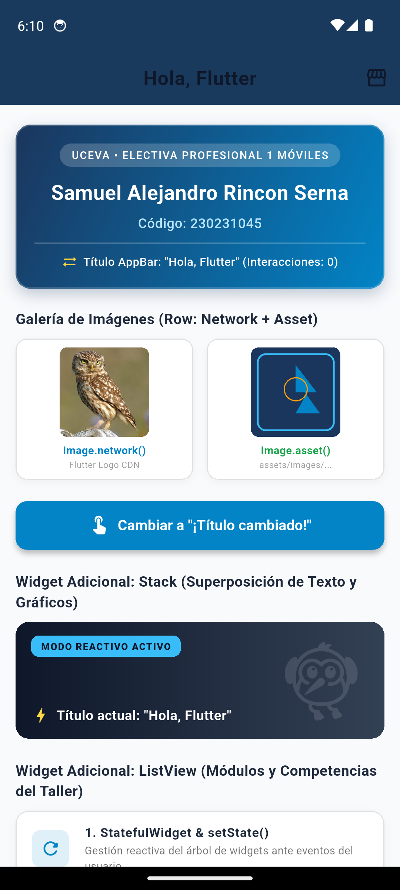
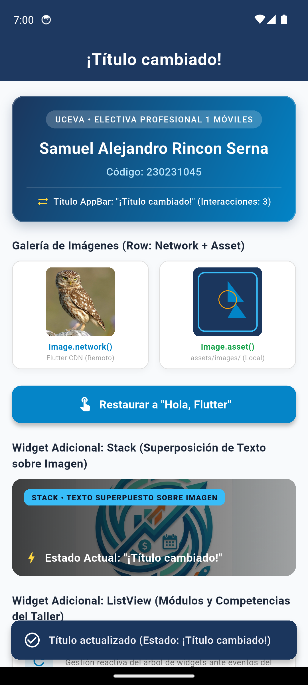
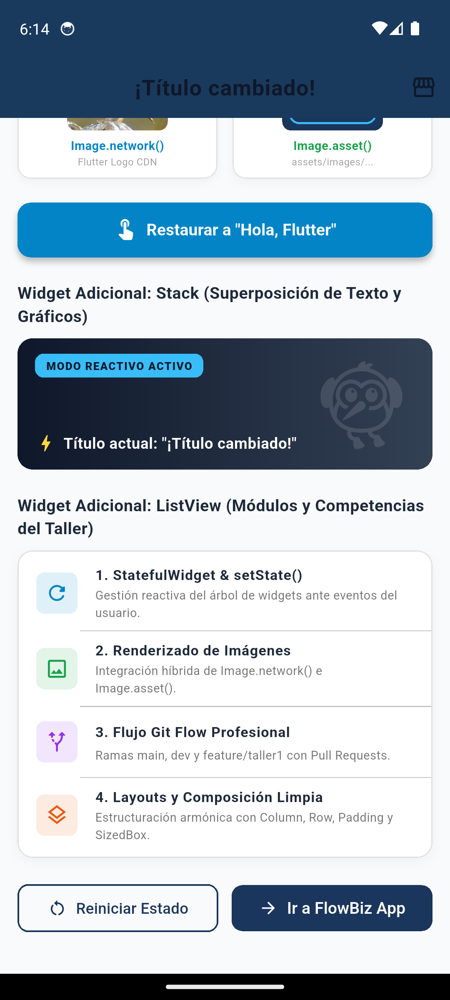

# FlowBiz 🚀
> **Gestión Integral de Operaciones, Agenda Inteligente, Caja y Finanzas para Pequeños Comercios**

[](https://flutter.dev)
[](https://dart.dev)
[](https://opensource.org/licenses/MIT)
[](#)

---

## 📱 Taller 1 – Flutter + Widgets + Git Flow
> **Implementación práctica de StatefulWidget, reactividad con setState(), layouts con imágenes híbridas y gestión de control de versiones con Git Flow.**

### 👤 Datos del Estudiante
- **Nombre Completo:** Samuel Alejandro Rincon Serna
- **Código Estudiantil:** 230231045
- **Institución:** Unidad Central del Valle del Cauca (UCEVA) — Tuluá, Valle
- **Asignatura:** Electiva Profesional 1 Móviles (Ingeniería de Sistemas)
- **Repositorio:** [https://github.com/Sarincon508/flowbiz](https://github.com/Sarincon508/flowbiz)
- **Rama del Taller:** `feature/taller1` (integrada hacia `dev` y luego hacia `main`)

---

### 🚀 Instrucciones de Ejecución
Para clonar, preparar y ejecutar este proyecto en tu emulador o dispositivo físico Android:

```bash
# 1. Clonar el repositorio
git clone https://github.com/Sarincon508/flowbiz.git
cd flowbiz

# 2. Cambiar a la rama de desarrollo o del taller
git checkout dev

# 3. Descargar dependencias de Flutter
flutter pub get

# 4. Verificar dispositivos/emuladores activos
flutter devices

# 5. Ejecutar la aplicación en el emulador Android
flutter run
```

---

### 📸 Evidencias Visuales de la Aplicación en Emulador

| 1. Estado Inicial (`Hola, Flutter`) | 2. Estado Interactivo (`¡Título cambiado!` + SnackBar) | 3. Widgets Adicionales (Stack & ListView) |
| :---: | :---: | :---: |
|  |  |  |

---

### 🧩 Resumen Técnico de Widgets Implementados
1. **StatefulWidget & setState():** Control reactivo del título del `AppBar` (`_tituloAppBar`), alternando entre `"Hola, Flutter"` y `"¡Título cambiado!"` mediante un botón `ElevatedButton`.
2. **SnackBar Flotante:** Notificación en tiempo real (`ScaffoldMessenger.of(context).showSnackBar()`) con el mensaje `"Título actualizado"`.
3. **Galería de Imágenes en Row:**
   - `Image.network()`: Carga remota asíncrona con indicadores de progreso y manejo de excepciones con fallback.
   - `Image.asset()`: Renderizado de recurso local empaquetado (`assets/images/flutter_taller.png`).
4. **Widgets Adicionales:**
   - **`Container` decorativo:** Gradiente institucional UCEVA Navy (`#1B365D`), bordes redondeados (`BorderRadius.circular(16)`), sombras de elevación y badge del estudiante centrado.
   - **`Stack` interactivo:** Superposición multicapa de marcas de agua dinámicas, etiquetas flotantes y texto en tiempo real que refleja el estado de la variable `_tituloAppBar`.
   - **`ListView` con `ListTile`:** Lista estructurada de 4 módulos y competencias técnicas con iconos personalizados y tipografía jerárquica.
   - **`OutlinedButton`:** Acción secundaria para restablecer el estado inicial a valores por defecto.

---

## 📌 1. Descripción del Proyecto

**FlowBiz** es una solución móvil de gestión operativa y financiera concebida para cerrar la brecha entre el agendamiento de citas, el punto de venta (POS) y la auditoría contable en micro y pequeños comercios de servicios (barberías, estéticas, spas, consultorios médicos, restaurantes pequeños y talleres).

La aplicación resuelve de raíz los descuadres diarios de efectivo integrando:
- **Apertura de Día:** Registro formal del saldo base en efectivo.
- **Punto de Venta (POS):** Registro ágil de ventas directas de productos y servicios por catálogo.
- **Agenda Inteligente con Cobro Flexible:** Sincronización automática de citas terminadas hacia la caja del día, gestionando abonos parciales, saldos pendientes y notas de cobro extra.
- **Control de Egresos y Caja Menor:** Registro instantáneo de salidas de dinero con captura fotográfica de comprobantes.
- **Cierre de Jornada y Arqueo:** Conciliación matemática asistida (Base Inicial + Ingresos - Egresos vs Efectivo Físico) con detección automática de faltantes o sobrantes.
- **Dashboard Analítico:** Métricas de rendimiento, ganancias netas y cuentas por cobrar en tiempo real.

---

## 🛠️ 2. Stack Tecnológico

- **Framework:** Flutter (Single Codebase para Android e iOS)
- **Lenguaje:** Dart
- **Persistencia Local (Offline-First):** Drift (SQLite reactivo tipado) / Hive
- **Backend & Sincronización:** Supabase / Firebase BaaS
- **Gestión de Estado:** Flutter BLoC / Riverpod
- **Almacenamiento Seguro:** flutter_secure_storage (Cifrado de credenciales y tokens)

---

## 🤝 3. Reglas de Colaboración y Flujo de Trabajo

Dado que el proyecto es ejecutado por **un único desarrollador (Solo Developer)**, el flujo de desarrollo está optimizado para garantizar la máxima disciplina, trazabilidad y calidad sin introducir burocracias innecesarias. Se adopta una variante profesional de **GitHub Flow Adaptado con Auto-Revisión (Self-Review PR Flow)**.

### 3.1 Estructura de Ramas

1. **Rama Principal (main):**
   - Es la rama de producción y código estable.
   - **Queda estrictamente prohibido hacer git push directo sobre main**.
   - Solo recibe cambios a través de **Pull Requests (PR)** aprobados y verificados.
   - Cada fusión a main debe generar una versión etiquetada (git tag) semántica (ej. v1.0.0).

2. **Ramas de Trabajo Temporales (Feature/Fix Branches):**
   - Toda nueva tarea nace a partir de la última versión de main.
   - Nomenclatura obligatoria:
     - eat/<nombre-funcionalidad>: Para nuevas características (ej. feat/caja-arqueo, feat/agenda-citas).
     - ix/<identificador-bug>: Para corrección de fallos (ej. fix/descuadre-abonos).
     - 
efactor/<modulo>: Para mejoras de arquitectura o rendimiento sin alterar comportamiento (ej. refactor/drift-database).
     - docs/<tema>: Para documentación (ej. docs/api-specs).
     - 	est/<suite>: Para ampliación de pruebas unitarias o de integración.

### 3.2 Convención de Commits (Conventional Commits)

Los mensajes de commit deben seguir el estándar de Conventional Commits:
- eat: implementar arqueo de caja con deteccion automatica de diferencias
- ix: corregir precision de decimales en abonos de citas
- 
efactor: desacoplar logica de balance de caja del bloc de presentacion
- 	est: agregar casos de prueba para cierre de jornada con faltante
- docs: actualizar guia de arquitectura offline-first en README

### 3.3 Protocolo de Pull Request y Auto-Revisión (Self-Review)

Aun trabajando en solitario, el uso de Pull Requests es obligatorio como mecanismo de control de calidad:
1. **Creación del PR:** Toda rama de trabajo debe publicarse en GitHub y abrir un PR hacia main.
2. **Plantilla de PR Obligatoria:**
   - **Descripción del Cambio:** Qué resuelve y qué módulos toca.
   - **Checklist de Calidad:** Verificación de tipos sin coma flotante para dinero, widgets const, y paso del linter (flutter analyze).
   - **Evidencia Visual / Pruebas:** Captura de pantalla del cambio o salida exitosa de flutter test.
3. **Integración Continua (GitHub Actions CI):**
   - Ejecución automática de flutter analyze y flutter test.
   - El PR no puede fusionarse si hay pruebas fallidas o warnings de estilo.
4. **Estrategia de Fusión:** Squash and Merge para mantener un historial limpio y legible en la rama main.

### 3.4 Protección de Ramas (Branch Protection Rules)

La rama main cuenta con las siguientes reglas configuradas en GitHub:
- [x] **Require a pull request before merging:** Bloquea pushes directos a main.
- [x] **Require approvals:** Requiere al menos 1 revisión/aprobación formal del PR.
- [x] **Require status checks to pass before merging:** Obliga a que los workflows de CI pasen satisfactoriamente.
- [x] **Require conversation resolution before merging:** Todos los comentarios y notas de revisión deben marcarse como resueltos.
- [x] **Do not allow bypassing the above settings:** Aplica las restricciones incluso para el administrador del repositorio.

---

## 👤 Autor

- **Desarrollador:** Samuel Rincón
- **Usuario GitHub:** [@Sarincon508](https://github.com/Sarincon508)
- **Correo Institucional:** [samuel.rincon01@uceva.edu.co](mailto:samuel.rincon01@uceva.edu.co)
- **Institución:** Unidad Central del Valle del Cauca (UCEVA) — Tuluá, Colombia
- **Programa:** Facultad de Ingeniería — Ingeniería de Sistemas
- **Asignatura:** Desarrollo de Aplicaciones Móviles
